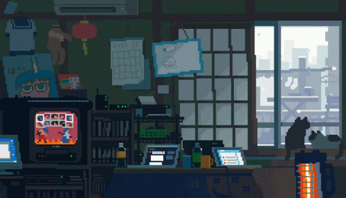

<h1 align="center">Hello!!👋</h1>
 
   
  
   <ul>
     
     <li>Front-end Developer specialized in Shopify, working on the development, customization, and maintenance of Shopify stores, both for new projects and existing live stores. I work with themes, integrations, apps, and Shopify Functions, as well as performance optimizations, always prioritizing user experience, responsiveness, and development best practices.

I have experience with Shopify (Liquid, APIs, and platform architecture), along with modern technologies such as React.js, TypeScript, JavaScript, and Node.js, applied both in the interface layer and in integrations and automations. I use Git/GitHub for version control and team collaboration, contributing to consistent and scalable deliveries in agile environments.
</li>
      
     <li>Feel free to check out my repositories!</li>
      
     <li>📫 How to reach me beniolimavasc@gmail.com</li>
      
   </ul>

 
   

    

  

    
  <h1>Languages and Tools:</h1>
  

    
    
    
    
    
    
    
    
    

  

 
<h1>Contatos</h1>
 
  
 

  

 

