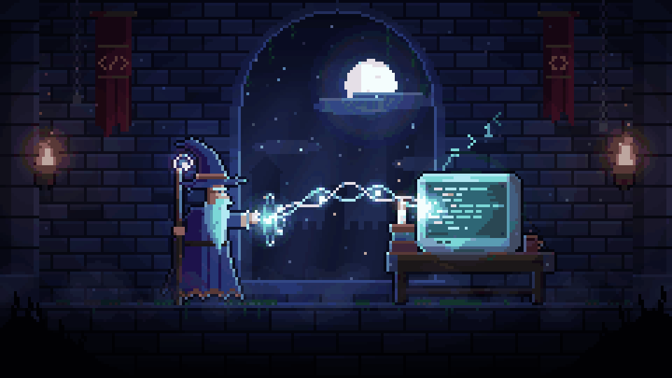

<p align="center">
  
</p>

<p align="center">
  
  
</p>


### 🧙‍♂️ About the Wizard



Front-end Developer specialized in **Shopify**, working on the development, customization, and maintenance of Shopify stores — both new projects and existing live stores. I work with **themes, integrations, apps, and Shopify Functions**, as well as performance optimizations, always prioritizing user experience, responsiveness, and development best practices.

I have experience with Shopify (**Liquid, APIs, and platform architecture**), along with **React.js, TypeScript, JavaScript, and Node.js**, applied both in the interface layer and in integrations and automations. I use **Git/GitHub** for version control and team collaboration, contributing to consistent and scalable deliveries in agile environments.

📜 Feel free to explore my repositories — each one is a page of the grimoire.

<br clear="right" />

### 📖 Character Sheet

```liquid
 loading character... 


{{ wizard.role }}      → Front-end Developer · Shopify Specialist
{{ wizard.spells }}    → Liquid · Themes · Shopify Functions · Apps & Integrations
{{ wizard.stack }}     → React.js · TypeScript · JavaScript · Node.js · GraphQL
{{ wizard.passives }}  → Performance · Responsiveness · UX · Best practices
{{ wizard.guild }}     → Git/GitHub · Agile teams · Scalable deliveries
```


<h3 align="center">🔮 Spellbook</h3>

<p align="center">
  
</p>

<h3 align="center">⚗️ Arcane Stats</h3>

<p align="center">
  
</p>


<h3 align="center">🦉 Send an Owl</h3>

<p align="center">
  <a href="mailto:beniolimavasc@gmail.com"></a>
  <a href="https://www.linkedin.com/in/bienolima19/" target="_blank"></a>
</p>

<p align="center">
  
</p>
